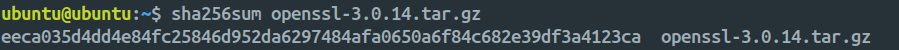

# OpenSSL Installation Guide (with SCTP Support)

## Pre-requisite

```sh
sudo apt update
sudo apt install -y build-essential perl libtext-template-perl zlib1g-dev libssl-dev libsctp-dev lksctp-tools git cmake autoconf libtool 
```

## 1 Download OpenSSL Source Code

Head over to the official [OpenSSL Downloads Page](https://www.openssl.org/source/) and choose the version you want to install. For this guide, we'll use version `3.0.14` as an example:

```sh
wget https://www.openssl.org/source/openssl-3.0.14.tar.gz
tar xzvf openssl-3.0.14.tar.gz
```

## 2 Verify the Download

Before proceeding, it's good practice to verify the integrity of the downloaded tarball using its SHA256 checksum (found on the OpenSSL download page):

```sh
sha256sum openssl-3.0.14.tar.gz
```

Compare the output with the checksum listed on the website to ensure the file hasn't been tampered with.

<br>



## 3 Build and Install OpenSSL

Navigate into the extracted directory and build OpenSSL with SCTP support:

```sh
cd openssl-3.0.14

./config -Wl,--enable-new-dtags,-rpath,'$(LIBRPATH)' --prefix=/usr/local/ enable-sctp

make
sudo make install
```

> [!NOTE]
> `--prefix` defines the installation directory (e.g., `/usr/local/`). This determines where binaries, libraries, and headers are placed.
> `enable-sctp` enables SCTP protocol support.
> You can customize where `openssl.cnf` will be placed via additional configuration options.
  
[View all OpenSSL build configuration options here](https://github.com/openssl/openssl/blob/master/INSTALL.md#directories)

## 4 Configure Environment Variables

Update your terminal's config file (e.g., `~/.bashrc`, `~/.zshrc`) with the following:

```sh
# Link OpenSSL libraries
export LD_LIBRARY_PATH=$LD_LIBRARY_PATH:/usr/local/lib64  # or /lib based on your config options

# Set the default OpenSSL binary path
export PATH=/usr/local/bin:$PATH

# For CMake and other build tools
export OPENSSL_ROOT_DIR=/home/ubuntu/openssl-3.0.14

# Optional: explicitly define OpenSSL config and binary locations
export OPENSSL_CONF=/usr/local/ssl/openssl.cnf
export OPENSSL_APP=/usr/local/bin/openssl
```

Then reload your shell config:

```sh
source ~/.bashrc
# source ~/.zshrc
```

## 5 Verify the Installation

Check the path of the installed OpenSSL binary:

```sh
which openssl
whereis openssl
```


## Additional References

- [Changing binary paths on Ubuntu](https://askubuntu.com/questions/1322134/how-do-i-change-an-existing-path-to-a-binary-so-that-it-points-to-a-newly-instal)
- [Creating custom OpenSSL environment variables](https://superuser.com/questions/1474361/how-do-i-create-an-environment-variable-openssl)